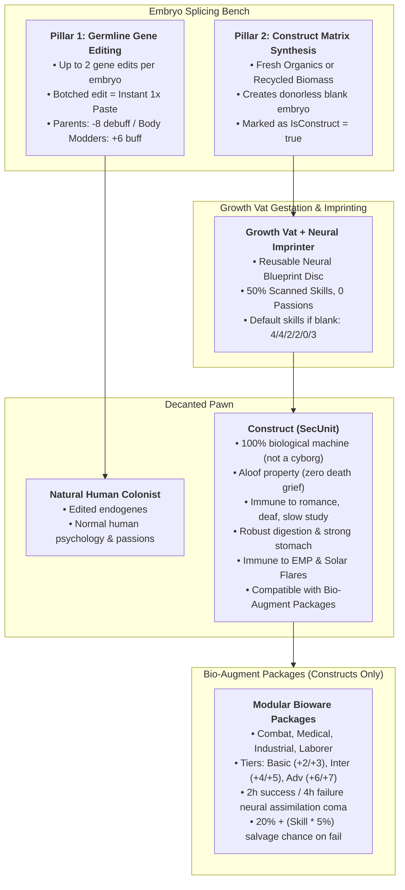

# Feature Specification: Eugenics Program

> [!IMPORTANT]
> **Target Environment: RimWorld 1.6 (Biotech)**
> All features, C# code, API signatures, and XML Defs are authored specifically for **RimWorld 1.6**. Developers and agents must ensure method signatures (especially around `RecipeWorker`, `CompGenepackContainer`, and `Building_GrowthVat`) conform strictly to RimWorld 1.6 `Assembly-CSharp.dll`.

This document serves as the authoritative architectural and functional blueprint for the **Eugenics Program** mod, representing the completed convergence of germline gene editing and artificial construct manufacturing.

---

## 1. Architectural Philosophy: The Two Pillars

The mod is architected around two fundamentally distinct biological systems:

---

## 2. Pillar 1: Germline Gene Editing

Germline gene editing allows colonies to refine inheritable endogenes in natural colonist embryos or construct matrices.

### 2.1 Editing Rules & Balancing

- **Work Location:** [`Building_EmbryoSplicingBench`](file:///home/tylerkilburn/Git/rimworld-mods/mods/custom/eugenics-program/Source/Buildings/Building_EmbryoSplicingBench.cs).
- **Edit Cap:** Strict maximum of **2 gene edits** per embryo. Tracked on the embryo component (`CompEmbryoQuality.editCount`).
- **Inheritance:** All edits modify the embryo's `geneSet`, ensuring all changes manifest as inheritable **endogenes**.

### 2.2 Splicing Failure (Instant Biomass Collapse)

- **Mechanic:** Splicing failure chance scales with doctor Medicine skill, Manipulation, and clean room factor.
- **Outcome on Failure:** The embryo collapses into **1× [`GeneticNutrientPaste`](file:///home/tylerkilburn/Git/rimworld-mods/mods/custom/eugenics-program/Defs/ThingDefs_Items/Items_Biomass.xml)** on the worktable.
- **Elimination of Busywork:** No hidden defects, no prenatal genomic sequencing bills, and no separate embryo culling bills.

### 2.3 Parental & Ideological Social Reactions

Tracked via `CompEmbryo.Father` and `CompEmbryo.Mother` when a natural embryo edit completes:

- **Standard Parents:** **-8 mood debuff for 10 days** (`ThoughtDef: ChildGeneticallyAltered`).
  - _Hover Text:_ _"Someone manipulated my unborn child's DNA in a laboratory. Splicing natural flesh like industrial material is an abhorrent violation of our family."_
- **Body Modder / Transhumanist Parents:** **+6 mood buff for 10 days** (`ThoughtDef: ChildBiologicallyUpgraded`).
  - _Hover Text:_ _"My unborn child was engineered at the splicing bench to transcend weak baseline genetics. True perfection begins before birth."_
- **Construct Embryos:** Have no parents (`Father = null, Mother = null`); zero parental thoughts generated.

---

## 3. Pillar 2: Constructs (Artificial Humans / SecUnits)

### 3.1 Innate Biology: 100% Biological Machines (NOT Cyborgs)

Constructs are **100% biological machines—they are NOT cyborgs**. They are engineered entirely from vat-grown organic tissue, living blood, synthetic neural wetware, and biological muscle. Because they contain zero metallic mechanical implants, microcircuits, or electronics:

- **Immunity to EMP & Solar Flares:** Electromagnetic pulses, EMP grenades/weapons, and solar flares have **absolutely zero effect** on constructs unless prosthetics (same prostetic rules as humans, no special logic) are installed later in their life. They cannot suffer brain shock, EMP stun, or power disruptions.
- **`Gene_ConstructPsychology` (+2 Met):** Cold indifference, immune to insults, incapable of romance, no social recreation decay.
- **`Trait_ConstructAsset`:** Property status; colonists suffer **zero mood penalties** when a construct dies or suffers.
- **Psychic Deafness (`PsychicSensitivity_Deaf` / +2 Met):** Immune to drones, psychic suppression, and psycasts.
- **Universal Sterility (`Gene_MandatorySterility` / +1 Met):** Completely sterile; cannot reproduce.
- **Very Unattractive (`Beauty_VeryUgly` / +2 Met):** Misshapen synthetic appearance; yields a positive metabolic surplus.
- **Stasis Hibernation (`Gene_ConstructHibernation` / +2 Met):** Non-hemogenic shutdown mode allowing constructs to enter a dormant power-saving stasis in any bed or spot.
  - **12-Hour Commitment:** Requires a minimum uninterrupted 12-hour (30,000 tick) cycle.
  - **Early Wake Penalty (`Hediff_InterruptedStasis`):** Interrupting or drafting before 12 hours applies the equivalent of interrupted deathrest (-20% consciousness, -10% moving, -10% manipulation, nausea for 3 days).
  - **Clean Wake Bonus:** Awakening after 12+ hours immediately resets the construct's Rest need to **100% (Fully Rested)** and resets their 30-day maintenance timer.
  - **30-Day Mandatory Maintenance Cycle:** Constructs must undergo a stasis purge cycle at least once every 30 in-game days.
    - _Advance Warning (Day 27):_ At 3 days remaining (75,000 ticks), player receives an alert: _"Construct Maintenance Warning: [Unit]'s biological buffer is reaching critical saturation (27/30 days). Construct physiology requires scheduled stasis hibernation within 3 days."_
    - _Emergency Failsafe Shutdown (Day 30):_ If 30 days elapse without maintenance, biological exhaustion forces immediate comatose shutdown wherever they stand: _"Construct Emergency Stasis: [Unit] has exceeded the 30-day operational limit without hibernation. Hardwired survival failsafes have forced an emergency 12-hour purge to prevent neural collapse."_
- **Low Sleep Baseline (`LowSleep` / -4 Met):** Engineered with a 40% rest fall rate by default. Can be upgraded / overwritten with **Never Sleep** (`Neversleep`) at the splicing bench if the embryo geneset is modified.
- **Slow Study (`Learning_Slow` / +2 Met):** Hardwired neural architecture; slow at acquiring new routine skills organically.
- **Robust Digestion (`RobustDigestion` / -2 Met):** Industrial-grade digestive enzymes allow nutrient extraction from raw organics, paste, and rough rations without penalty.
- **Strong Stomach (`StrongStomach` / -1 Met):** Sterile synthetic gastrointestinal lining provides total immunity to food poisoning.
- **Metabolically Efficient (`Construct_MetabolicallyEfficient` / +5 Met):** Excision of empathy and inhibition yields a high metabolic dividend. Automatically forces **Psychopath** and **Bloodlust** traits.
- **Strict Xenogerm Rejection (Locked Genome):** Constructs cannot receive vanilla or modded Xenogerms. Standard gene implantation is blocked via Harmony patch (`Recipe_ImplantXenogerm`: _"Cannot implant xenogerm: Synthetic construct genetic architecture is permanently locked"_). Constructs must rely exclusively on modular Bio-Augment Packages.

---

### 3.2 Blank Matrix Synthesis (Zero External Cloning Dependency)

Constructs bypass the need for biological donors or third-party cloning mods (such as _Biotech Cloning Continued_ / `zal.cloning`). The mod is **100% self-contained**, requiring only vanilla Biotech and Harmony.

Synthesized directly at the `EmbryoSplicingBench`:

| Bill Name                                      | Required Ingredients                                                             | Output                                  |
| :--------------------------------------------- | :------------------------------------------------------------------------------- | :-------------------------------------- |
| **Synthesize Blank Embryo (Fresh Organics)**   | 40 Raw Meat, 40 Raw Plants, 10 Neutroamine, 2 Medicine                           | 1× `HumanEmbryo` (`IsConstruct = true`) |
| **Synthesize Blank Embryo (Recycled Biomass)** | 1× `GeneticNutrientPaste`, 10 Raw Meat, 10 Raw Plants, 5 Neutroamine, 2 Medicine | 1× `HumanEmbryo` (`IsConstruct = true`) |

---

### 3.3 Storage Compatibility: Gene Banks

Vanilla `Building_GeneBank` facilities natively store, manage, and refrigerate both:

1. **`GenomeBlueprintDisk`:** Master biological caste discs.
2. **`NeuralBlueprintDisk`:** Encoded neural doctrine discs.

_(Implemented via a Harmony postfix patch on `CompGenepackContainer.CanStore` and container acceptance logic)._

---

### 3.4 Bio-Augment Packages (Construct-Exclusive Bioware)

Modular bio-augment packages grafted and excised via standard surgical operations at medical beds. Because constructs are 100% biological machines engineered with pre-integrated organic neural buses, they interface natively with these modular wetware packages. Natural-born humans lack this biological bus infrastructure and reject the bioware.

#### Surgery Rules & Safeguards

- **Construct-Exclusive:** Surgical bill checks for `Trait_ConstructAsset` or `Gene_ConstructPsychology`. Baseline humans reject the neural bus and cannot receive the bill (_"Cannot graft: Incompatible biological neural bus (Requires Construct)"_).
- **Bio-Wetware Architecture (Total EMP Immunity):** Packages are engineered as bio-synthetic wetware modules (vat-grown organic nerve bundles and biological coprocessors) rather than electronic prosthetics. **EMP attacks and Solar Flares have zero effect** on installed augment packages.
- **Doctor Skill Gates:**
  - **Basic Tiers:** Medical 4+
  - **Intermediate Tiers:** Medical 7+
  - **Advanced Tiers:** Medical 10+
- **Neural Assimilation Coma (`Hediff_ConstructAssimilation`):**
  - **On Successful Surgery:** 2 in-game hours (5,000 ticks) as neural synapses integrate.
  - **On Failed Surgery:** 4 in-game hours (10,000 ticks) of neurogenic shock + minor surgical lacerations.
- **Bio-Package Salvage on Failure:**
  $$\text{Salvage Chance} = 20\% + (\text{Doctor's Medical Skill} \times 5\%)$$
  - _Success:_ Bio-package drops safely to the floor undamaged.
  - _Failure:_ Bio-package tissue tears and is ruined.

#### Package Catalog & Skill Offsets

| Package Def                            | Tier         | Skill Offsets                     | Work / Tech Level |
| :------------------------------------- | :----------- | :-------------------------------- | :---------------- |
| **`ConstructAugment_CombatBasic`**     | Basic        | +2 Shooting, +2 Melee             | Machining         |
| **`ConstructAugment_CombatInter`**     | Intermediate | +4 Shooting, +4 Melee             | Microelectronics  |
| **`ConstructAugment_CombatAdv`**       | Advanced     | +6 Shooting, +6 Melee             | Fabrication       |
| **`ConstructAugment_MedicalBasic`**    | Basic        | +3 Medical                        | Machining         |
| **`ConstructAugment_MedicalInter`**    | Intermediate | +5 Medical                        | Microelectronics  |
| **`ConstructAugment_MedicalAdv`**      | Advanced     | +7 Medical                        | Fabrication       |
| **`ConstructAugment_IndustrialBasic`** | Basic        | +3 Construction, +3 Mining        | Machining         |
| **`ConstructAugment_IndustrialInter`** | Intermediate | +5 Construction, +5 Mining        | Microelectronics  |
| **`ConstructAugment_IndustrialAdv`**   | Advanced     | +7 Construction, +7 Mining        | Fabrication       |
| **`ConstructAugment_LaborerBasic`**    | Basic        | +2 Cooking, +2 Plants, +2 Animals | Machining         |
| **`ConstructAugment_LaborerInter`**    | Intermediate | +4 Cooking, +4 Plants, +4 Animals | Microelectronics  |
| **`ConstructAugment_LaborerAdv`**      | Advanced     | +6 Cooking, +6 Plants, +6 Animals | Fabrication       |

---

### 3.5 Construct Skills & Neural Imprinting

#### Growth Vat Imprinting Engine

- **Reusable Master Discs:** The [`NeuralBlueprintDisk`](file:///home/tylerkilburn/Git/rimworld-mods/mods/custom/eugenics-program/Defs/ThingDefs_Items/Items_Blueprints.xml) is **never consumed** upon vat decanting. It remains loaded in the vat's imprinter comp until manually ejected.
- **Loading Window:** Discs can be loaded before or during gestation/acceleration.
- **Skill Transfer Multiplier:** Constructs inherit **50% of the scanned mentor's skill levels**.
- **Zero Passions:** Constructs **never possess passions**. All injected and generated passions are forced to `Passion.None`.
- **Scanner Block:** `Building_NeuralScanner` blocks constructs from being scanned as mentors.

#### Baseline Decanting (Without Neural Disc)

Constructs decanted from a vat without any neural imprint disc receive innate baseline neural reflexes:

- **Shooting:** 4
- **Melee:** 4
- **Social:** 2
- **Intellectual:** 2
- **Artistic:** 0
- **All Other Skills:** 3
