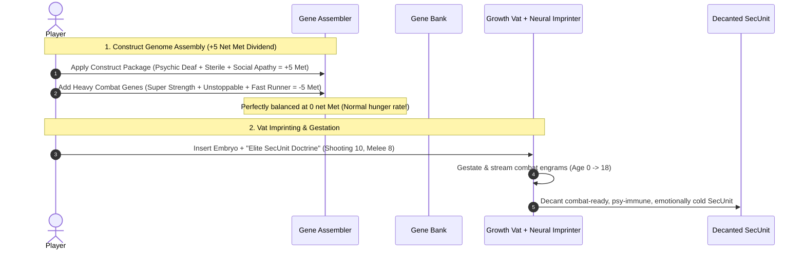

# Feature Specification: Eugenics Program & Eugenics Blueprints

## 1. Overview & Vision

**Eugenics Program** is a RimWorld Biotech expansion mod that enables colonists to genetically engineer and neuro-imprint human embryos prior to growth vat gestation.

Inspired by dystopian eugenics and the _"Construct / SecUnit"_ concept from _The Murderbot Diaries_, players can mass-produce specialized, combat-ready, or industrial clone castes using physical **Genome Blueprint Discs** and **Neural Imprint Doctrines**. Spliced constructs are engineered for hyper-efficiency: sterile, psychically deaf, emotionally blunted, and treated as living property. Stripping these human functions yields a massive **Metabolic Dividend** that naturally finances augmentations.

---

## 2. Core Mechanics & Requirements

### 2.1 Embryo Editing Vehicle

- **Facility:** Vanilla `Building_GeneAssembler` connected to `Building_GeneBank` facilities.
- **Work Type:** Assembly work performed by researchers / doctors (utilizing Research or Medical skills).
- **Input Target:** Any unfertilized/fertilized `HumanEmbryo` item (or cloned embryo).

### 2.2 Gene Splicing Operations

- **Gene Addition:**
  - Any `GeneDef` contained within the connected `GeneBank`s can be added to the embryo.
  - Subject to standard or expanded complexity and metabolic efficiency limits.
- **Gene Removal:**
  - A gene present on the embryo can only be removed if that exact `GeneDef` is currently available in the connected `GeneBank` (acting as a targeted molecular template).
- **Genetic Layer:**
  - Modifications apply to the embryo's inheritable **Endogenes** (germline DNA).

### 2.3 The "Construct" Package & Metabolic Dividends

Constructs are biologically optimized by stripping superfluous human faculties, converting those debuffs directly into positive metabolic efficiency (`biostatMet`) budget:

- **Psychic Deafness (`PsychicSensitivity_Deaf` / `+2 Met`):** (stock game gene)
  - Immune to psychic drones, psychic attacks, and psychic suppression; unable to use psycasts or bond with anima trees.
- **Universal Sterility (`Gene_MandatorySterility` / `+1 Met`):** (stock game gene)
  - Prevents unauthorized reproduction and gene drift, securing corporate/colony biological ownership.
- **Social Apathy & Emotional Blunting (`Gene_ConstructPsychology` / `+2 Met`):**
  - Completely incapable of romance, no social recreation need, no loneliness/solitude debuffs, immune to social insults and insults others with cold indifference.
- Very Unattractive (stock game gene)
  - Carriers of this gene have misshapen, asymmetrical facial structures and blotchy skin. They're hard to look at.
- Deathrest (stock gene)
  - Construct unit needs to recuperate from time to time. This allows them to be placed in stasis when not used.
- Slow Study (stock gene)
  - Features have been pre-programmed, and learning new routines is not a primary specification for the construct
- **Metabolically Efficient (+5 Free `biostatMet`)**: (custom gene)
  - Grants the vanilla Psychopath and Bloodlust traits, reflecting the removal of empathy and inhibition, while converting those behavioral changes into a clean metabolic surplus.

### 2.4 Social & Property Dynamics (The Murderbot Model)

- **Property Status:**
  - Natural-born colonists view vat-bred constructs as company/colony assets rather than human peers.
  - Colonists suffer zero mood penalties when a construct dies in combat or is subjected to grueling conditions.
- **Behavioral Directives:**
  - Constructs do not engage in idle banter or recreation drama, operating with single-minded devotion to their assigned work and security protocols.

### 2.5 Hybrid Neural Imprinting (Growth Vat Skill Injection)

- **Vat Maturation Without Penalties:**
  - Overcomes vanilla's vat-growth skill penalties by streaming combat and labor doctrines directly into the developing brain from age 0 to 18.
- **Hybrid Neural Doctrine Acquisition:**
  - **Researchable Base Doctrines (Levels 4–6):** Standard corporate packages unlocked via tech tree (_Basic Security Unit_, _Standard Field Medic_, _Industrial Drone_).
  - **Elite Mentor Scanning (Levels 8–14+):** Veteran colonists sit in a **Neural Scanner** to export their personal skills and combat passions into a high-tier doctrine disc.
  - **Ancient SecUnit Discs:** Ultra-rare, uncraftable military combat doctrines recovered from ancient complexes.

### 2.6 Optimizer Genes & Targeted Cellular Instability

- **High-Yield Limit Breakers:**
  - _Mitochondrial Overdrive (+8 Met)_: Overclocks metabolic energy at the cost of `CellInstability_Major` (0.5x lifespan, high cancer rate).
  - _Genomic Compression (-10 Cpx)_: Compresses DNA complexity at the cost of chronic cellular degradation.
- **Targeted Balance:** Cellular instability applies **only** when using artificial optimizer genes to exceed normal biological thresholds.

### 2.7 Splicing Complications & Skill-Based Diagnostics

- **Splicing Complications:** Low-skill doctors or dirty rooms risk introducing hidden mutations or congenital defects.
- **Skill-Based Screening:** Hidden defects can only be discovered prior to vat insertion by high-skill doctors running a _"Prenatal Genomic Screening"_ bill.
- **Biomass Liquefaction:** Defective or culled embryos are liquefied into **Nutritive Genetic Paste** to fuel growth vats for the next batch.

### 2.8 Physical Blueprint Discs (`GenomeBlueprintDisk` & `NeuralBlueprintDisk`)

- Physical data discs stored in Gene Banks, tradeable with orbital factions, or loaded into Growth Vats to automate mass construct manufacturing.

---

## 3. User Experience & Flow

---

## 4. Technical Architecture

### 4.1 C# Components & Harmony Patches

- **Construct Social & Property System:**
  - `Gene_ConstructPsychology`: Suppresses social recreation, romance, and banter while awarding +2 `biostatMet`.
  - `TraitDef: Trait_ConstructAsset`: Enforces property status and social isolation.
  - `ThoughtWorker_ConstructProperty`: Suppresses colonist death/suffering mood debuffs for construct pawns.
- **Neural Imprinting Engine:**
  - `ThingDef: NeuralBlueprintDisk` storing encoded skills and passion distributions.
  - `Building_NeuralScanner`: Facility for capturing colonist neural engrams.
  - `CompGrowthVatImprinter`: Infuses skills and passions during vat growth cycles.
- **Data Structures & Jobs:**
  - `CompGenomeBlueprint`, `CompEmbryoQuality`.
  - `JobDriver_EditEmbryoGenes`, `JobDriver_ScanNeuralProfile`, `JobDriver_ScreenEmbryo`, `JobDriver_RecycleEmbryo`.

### 4.2 Data & XML Definitions

- `ThingDef`: `GenomeBlueprintDisk`, `NeuralBlueprintDisk`, `GeneticNutrientPaste`, `NeuralScanner`
- `GeneDef`: `Gene_MandatorySterility`, `Gene_ConstructPsychology`, `Gene_MitochondrialOverdrive`, `Gene_HyperDenseGenome`
- `TraitDef`: `VatBred_Construct`
- `RecipeDef`: `EncodeGenomeBlueprintDisc`, `ScanNeuralDoctrine`, `ScreenEmbryoGenetics`, `LiquefyEmbryoBiomass`

### 4.3 XML-Driven Configuration Standards

- All tuning factors, skill thresholds, tick intervals, and numerical balances must be exposed in XML via standard Def fields, `DefModExtension`s, or custom `CompProperties`.
- Avoid hardcoded magic numbers in C# logic to allow user-level balance tuning and third-party mod compatibility.

---

## User QA

The user will need a runbook to allow for quick QA instead of needing to play the game for hours to unlock mechanics naturally. Dev tools are a good fit, but user does not know how to use them.

## 6. Phased Implementation Roadmap

### Phase 1: Construct Foundation Genes & Metabolic Balance

- [x] Scaffold mod directory structure (`About/About.xml`, `Source/`, `Assemblies/`, `Defs/`, `.csproj`).
- [x] Implement construct foundation genes (`Gene_ConstructPsychology`, `Construct_MetabolicallyEfficient`, `Gene_MandatorySterility`).
- [x] Implement optimizer genes (`Gene_MitochondrialOverdrive`, `Gene_GenomicCompression`).
- [x] Implement construct trait (`Trait_ConstructAsset`) and situational thought (`Construct_ColdEfficiency`).
- [x] Implement Harmony patches suppressing romance, marriage proposals, deep talk, and colonist grief thoughts for construct pawns.
- [x] Implement research projects (`Eugenics_ConstructFoundations`, `Eugenics_GeneOptimization`).

### Phase 2: Blueprint & Neural Discs Data Model

- [x] Implement `GenomeBlueprintDisk` and `NeuralBlueprintDisk` items with serialized data comps.
- [x] Implement `CompEmbryoQuality` (defect tracking, screening status) and XML patch attaching it to `HumanEmbryo`.
- [x] Implement `GeneticNutrientPaste` item for culled embryo biomass recycling.
- [x] Ensure all tuning parameters and thresholds are exposed via XML `CompProperties`.

### Phase 3: Neural Scanner & Growth Vat Imprinting Engine

- [x] Implement `Building_NeuralScanner` and colonist brain-scanning job.
- [x] Implement `CompGrowthVatImprinter` to inject skills and passions directly during vat acceleration.

### Phase 4: Splicing UI, Diagnostics & Biomass Recycling

- [x] Create `Dialog_EditEmbryoGenes` with conditional gene removal and "Burn Disc" actions.
- [x] Implement skill-gated prenatal screening and biomass liquefaction into `GeneticNutrientPaste`.

### Phase 5: Batch Automation & Mod Ecosystem Validation (Design: `docs/eugenics-phase5-design.md`)

- [x] Implement dedicated `EmbryoSplicingBench` (`Building_WorkTable`, visual copy of Gene Assembler) with native bills support.
- [x] Implement `Recipe_BatchApplyBlueprint` (preserving `GenomeBlueprintDisk` master matrix) and companion screening/recycling bills.
- [x] Ecosystem compatibility validation with _Biotech Cloning Continued_ (`zal.cloning`) and vanilla `Building_GrowthVat`.
- [x] Dev-mode QA runbook (`docs/eugenics-qa-runbook.md`).
